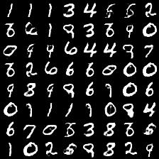
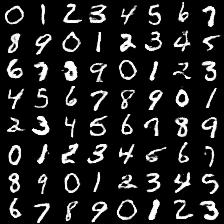

# Generative-Adversarial-Networks

after read the GAN papers, I find the excellent code in github, then decouple them and extract the kernel part（or write by myself） into ipython notebook for easy understanding。   

The below ipynbs use mnist for training and inferencing     
vanllia_GAN:   

setp=5700

conditional_GAN:    

setp=24900

DCGAN:

setp=5700

EBGAN:

setp=5700

LSGAN:

 

setp=5700.left:without conditional ; right:with conditional
  
AAE Label information incorporating:   

 

setp=5700.left:Learned MNIST manifold ; right:Distribution of labeled data
  
