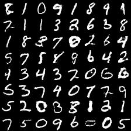
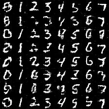
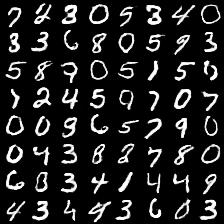
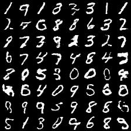

# Generative-Adversarial-Networks

after read the GAN papers, I find the excellent code in github, then decouple them and extract the kernel part（or write by myself） into ipython notebook for easy understanding。   

after you put the mnist data into the specified path, you can run the notebook。 

vanllia_GAN:   

setp=5700

conditional_GAN:    

setp=24900

DCGAN:

setp=5700

EBGAN:

setp=5700

